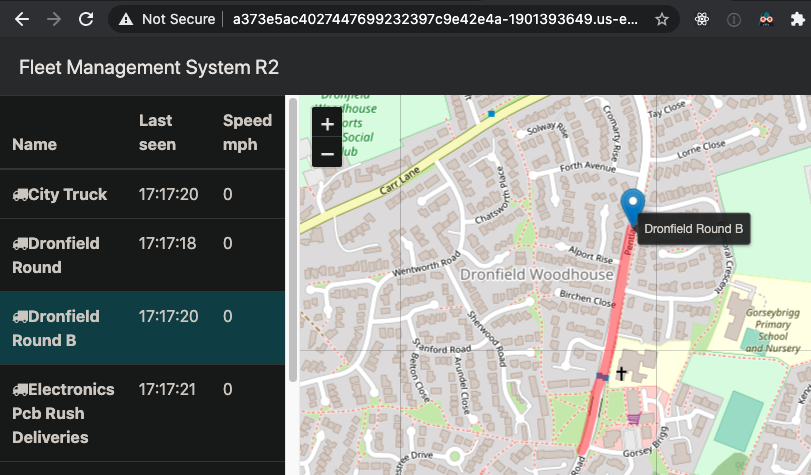
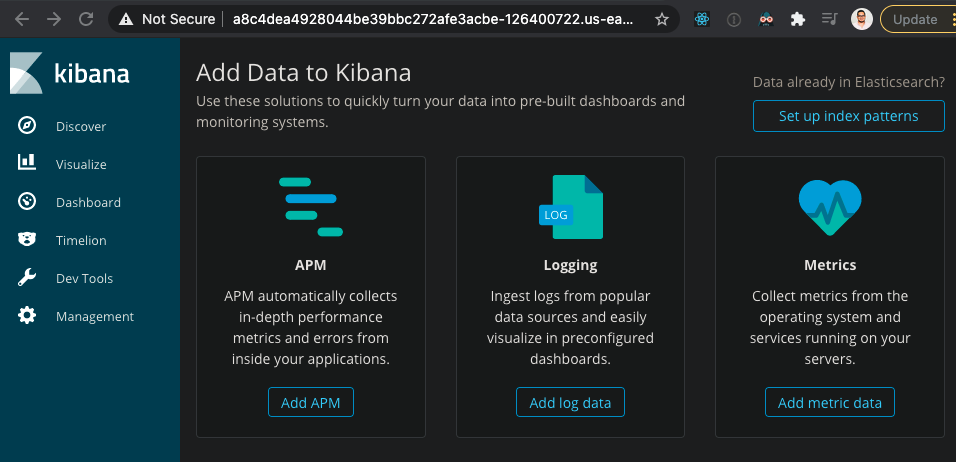
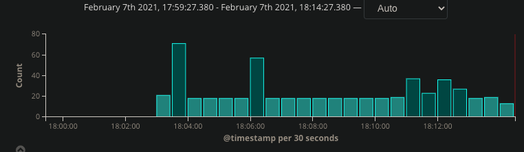
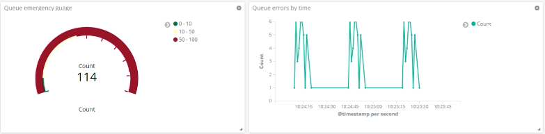
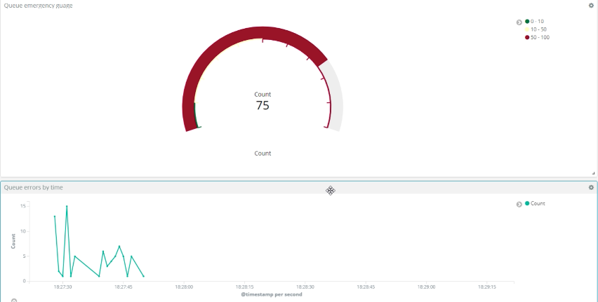
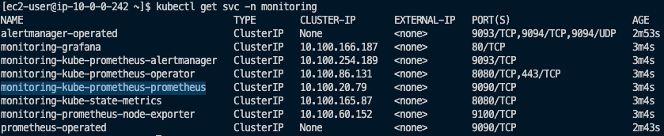
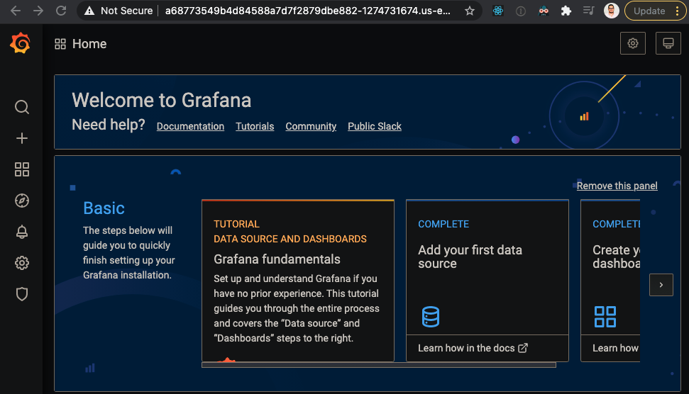
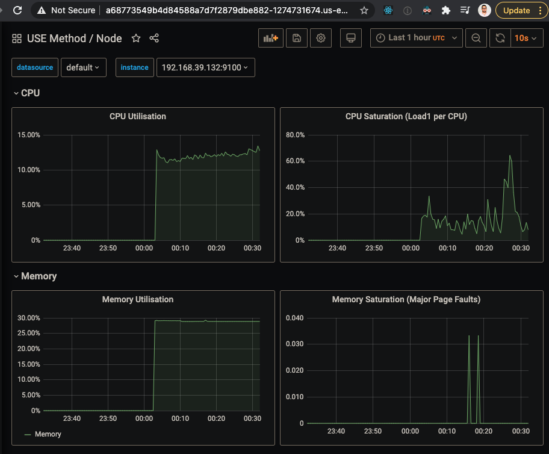
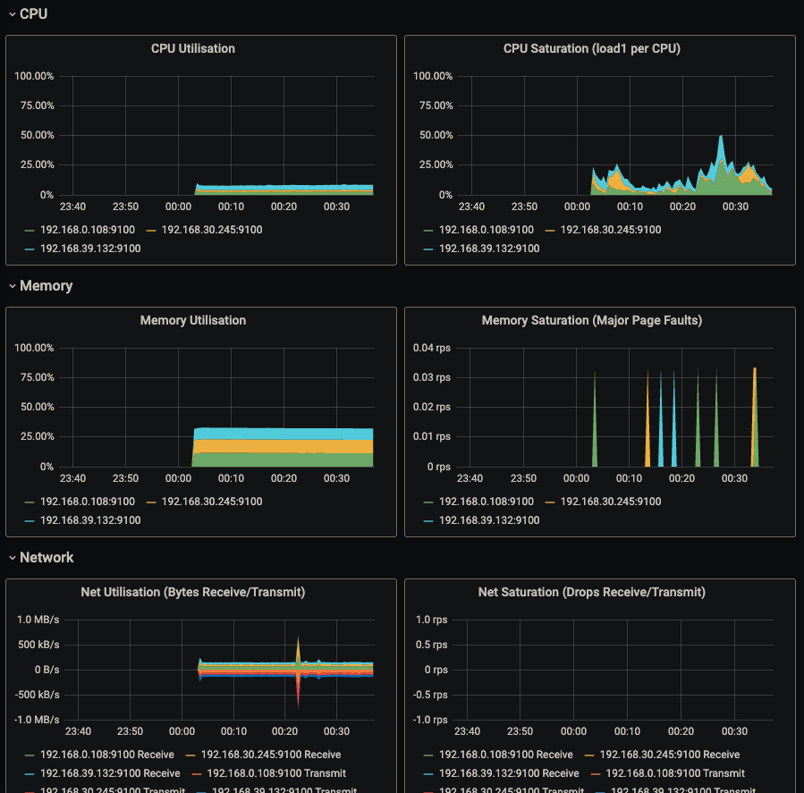

# Microservice Arquitecture with AWS
## Scenario
Since this is more Ops related, lets pretend that the development team has done all the app coding, and that they pushed the Docker Image for us to deploy.

Data given from developers:
- `queue` microservice is accessible on port: `8161`
- `position-simulator` microservice has no access port
- `position-tracker` microservice is accessible on port: `8080`
  - REST URI is in the form `/GET /vehicles/{vehicle name}` (note the blank space)

## Deploying A New Release
You won't see it in the code, but we started on the `workloads` file all the docker images with `release1`. Now, suppose we have a new version, `release2`, and they way to currently do it manually is by editing the file, and then do `kubectl apply -f .`

We then see the following happening under the hood:


Pretty cool!

This is how the new `release2` version looks like (before there was no traking, denoted by the red drawing, of the trucks).


## Problems for Release 2
The records of the tracker are stored in memory, inside the app running the container. Eventually the pod will run out the memory (can take a long time). In a microservice architecture, we have to design so that they are resilient to failure.

Entering: A database microservice.

## Release 3
This allows that the `position-simulator` (tracker), only handles one thing only (remember, microservices is all about the `single responsibility principle`) by storing the tracker data into the new mongodb instance.

You can confirm data persistance by deleting the position tracker pod:
- `kubectl delete pod/position-tracker-<rs-id>-<pod-id>`

However, it is not _really_ persistent, due to the fact that if the mongodb instance crashes for any reason, all data will be lost.

Entering: `Persistent Volumes`

## Volumes (for local dev)
Note that for development/testing locally purposes, the type `hostPath` was chosen, as shown below. This wont be necessary for when deploying to AWS.

```yaml
spec:
  containers:
    - name: queue
      image: mongo:3.6.5-jessie
      volumeMounts:
        - name: mongo-persistent-storage
          mountPath: /data/db
  volumes:
    - name: mongo-persistent-storage
      hostPath:
        path: /mnt/mongo-storage
        type: DirectoryOrCreate
```

And now, when we apply, and do `kubectl describe pod/mongodb-<rs-id>-<pod-id>` we see that it succesfully mounted:


## Persistent Volume Claims
It can be a burden to always be changing the type of storage the database will be using for persitance. Instead, we can add a configuration file "claiming" for the configuration.

`storage.yml`:
- `kind: PersistentVolumeClaim` explains the "what we want"
- `kind: PersistentVolume` explain how we want it implemented (physical storage)
- `storageClassName` is how we link/bind both

and we can confirm the new volume mount creation by: `kubectl get pv`:


## AWS EKS vs Kops
The main purpose of this project is to learn how to manage kubernetes cluster within the AWS ecosystem. Therefore, EKS was chosen, despite that Kops can also be ran in AWS.

The only _main_ difference, in my opinion, is:
- EKS manages the `master node` for you, you dont even see it running as a EC2 instance whereas in Kops you have to manage it

## AWS EKS
### Setting up a Bastion Server
- AMI: `Amazon Linux 2`

SSH into it to configure.

### Install eksctl
Do commands:
```bash
curl --silent --location "https://github.com/weaveworks/eksctl/releases/latest/download/eksctl_$(uname -s)_amd64.tar.gz" | tar xz -C /tmp
sudo mv /tmp/eksctl /usr/local/bin
```
- Make sure to have AWS CLI version >= 2

```bash
curl "https://awscli.amazonaws.com/awscli-exe-linux-x86_64.zip" -o "awscliv2.zip"
unzip awscliv2.zip
sudo ./aws/install
```
- Refer to [this](https://eksctl.io/usage/minimum-iam-policies/) to configure IAM Policies

### Install kubeclt
```bash
export RELEASE=1.18.0 # must be the default k8s version from aws
curl -LO https://storage.googleapis.com/kubernetes-release/release/v$RELEASE/bin/linux/amd64/kubectl
chmod +x ./kubectl
sudo mv ./kubectl /usr/local/bin/kubectl
```
Verify installation:
```bash
kubectl version --client
```

### Create a Cluster
```bash
eksctl create cluster --name <project-name> --nodes-min=3
```

### Deploy Cluster
For simplicity purposes, just create `yml` files on your bastion server, and then do `kubectl apply -f .`

You will see that a new EBS volume and a Load Balancer were created. Access the DNS of the load balancer, and you should see the application!



### Monitoring
The usual `kubectl get pods` command does not give a lot of information on where the pods are deployed. But by doing `kubectl get pods -o wide` it will tell you where they are running. They will point ot the private DNS on AWS.

## ELK Stack
Elastic Search, Fluentd, and Kibana integration for viewing logging of nodes.

Related files:
- `elastic-stack.yml`
- `fluentd-config.yml`

All this configurations come from the official kubernetes github [page](https://github.com/kubernetes/kubernetes/tree/master/cluster/addons/fluentd-elasticsearch).

Apply those files and see the new pods by doing 

```bash
kubectl get po -n kube-system
```

Check that everything went well by doing
```bash
kubectl describe svc kibana-logging -n kube-system
```
Then get the LoadBalancer Ingress, and visit it on port `5601`. You should see the following:



AWESOME!

To look at the generated logs so far, got to `Discover` tab on the left-side menu, and then you should see something like this:



Below the graph you can find all the details of those logs. This could be a good place to find application errors.

With Kibana, you can save your log queries, create a visualization, and then create a dashboard. By setting the `queue` service to zero, we can simulate an emergency situation, in which case the graphs could be helpful:



Set back the queue service and over time you will see the graphs coming to a healthy state:



all the way to zero.

## Monitoring with Prometheus and Grafana
Using a package manager for k8s with `helm-charts`.

Related files:
- `crds.yml`
- `monitoring.yml`

Apply first the `crds.yml` followed by the `monitoring.yml`

to ensure everything went well, do:
```bash
kubectl get svc -n monitoring
```

The UI Prometheus will be the one that has the double prometheus name, `monitoring-kube-prometheus-prometheus`.



To access Grafana, we can do a little hack by editing the grafana service. This is useful to give access to monitoring to system administrators.

```bash
kubectl edit svc -n monitoring monitoring-grafana
```
and go to the bottom of the file, and change the `type` to `LoadBalancer`.

then do
```bash
kubectl get svc -n monitoring
```
and grab the loadbalancer DNS. You will see the Grafana login page. Access it with default credentials of 
- username: `admin`
- password: `prom-operator`

then you will see the welcome screen: 



By clicking `Home` on the top, choose `USE Method / Node`. 

The USE method is a concept of monitoring. It does not have to be for kubernetes, but for other types of applications. If you're wondering, the acronyms mean:
- U: Utilization 
- S: Saturation 
- E: Errors

which are essential for monitoring the `health` of the app.

In this dashboard:



we can only see one node at a time. On the top side, on `instance` you can see the private IP of the node. Because you only see one node at a time, its better if we switch to `USE Method / Cluster`



Now, this is the dashboard that most likely you will want to have displaying at a work office. It is way easier to spot if something weird is going on.
