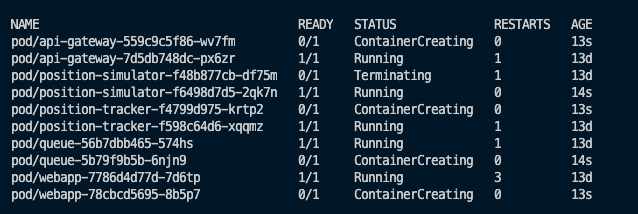
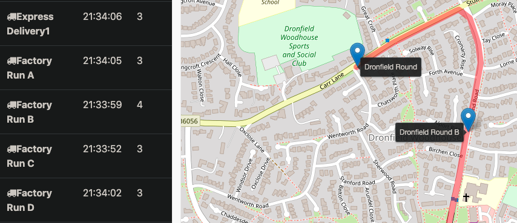
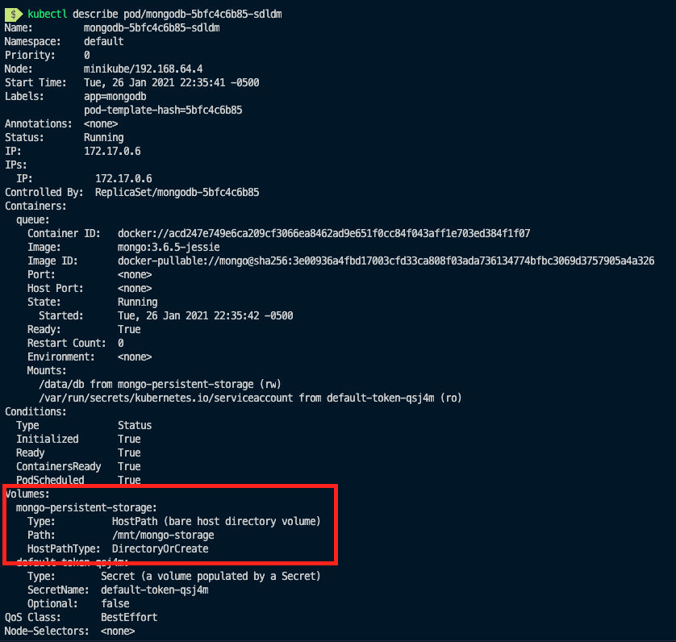
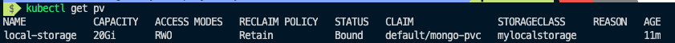

# Microservice Arquitecture with AWS
## Scenario
Since this is more Ops related, lets pretend that the development team has done all the app coding, and that they pushed the Docker Image for us to deploy.

Data given from developers:
- `queue` microservice is accessible on port: `8161`
- `position-simulator` microservice has no access port
- `position-tracker` microservice is accessible on port: `8080`
  - REST URI is in the form `/GET /vehicles/{vehicle name}` (note the blank space)

## Deploying A New Release
You won't see it in the code, but we started on the `workloads` file all the docker images with `release1`. Now, suppose we have a new version, `release2`, and they way to currently do it manually is by editing the file, and then do `kubectl apply -f .`

We then see the following happening under the hood:



Pretty cool!

This is how the new `release2` version looks like (before, there was no traking, denoted by the red drawing, of the trucks).



## Problems for Release 2
The records of the tracker are stored in memory, inside the app running the container. Eventually the pod will run out the memory (can take a long time). In a microservice architecture, we have to design so that they are resilient to failure.

Entering: A database microservice.

## Release 3
This allows that the `position-simulator` (tracker), only handles one thing only (remember, microservices is all about the `single responsibility principle) by storing the tracker data into the new mongodb instance.

You can confirm data persistance by deleting the position tracker pod:
- `kubectl delete pod/position-tracker-<rs-id>-<pod-id>`

However, it is now _really_ persistent, due to the fact that if the mongodb instance crashes for any reason, all data will be lost.

Entering: `Persistent Volumes`

## Volumes (for local dev)
Note that for development/testing locally purposes, the type `hostPath` was chosen, as shown below. This wont be necessary for when deploying to AWS.

```yaml
spec:
  containers:
    - name: queue
      image: mongo:3.6.5-jessie
      volumeMounts:
        - name: mongo-persistent-storage
          mountPath: /data/db
  volumes:
    - name: mongo-persistent-storage
      hostPath:
        path: /mnt/mongo-storage
        type: DirectoryOrCreate
```

And now, when we apply, and do `kubectl describe pod/mongodb-<rs-id>-<pod-id>` we see that it succesfully mounted:



## Persistent Volume Claims
It can be a burden to always be changing the type of storage the database will be using for persitance. Instead, we can add a configuration file "claiming" for the configuration.

`storage.yml`:
- `kind: PersistentVolumeClaim` explains the "what we want"
- `kind: PersistentVolume` explain how we want it implemented (physical storage)
- `storageClassName` is how we link/bind both

and we can confirm the new volume mount creation by: `kubectl get pv`:


