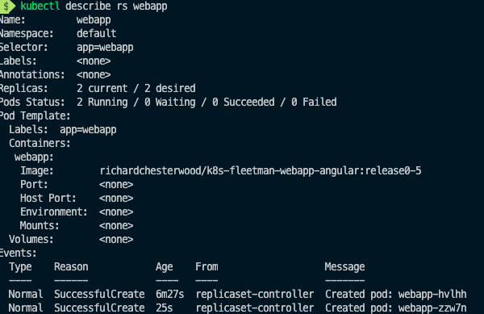
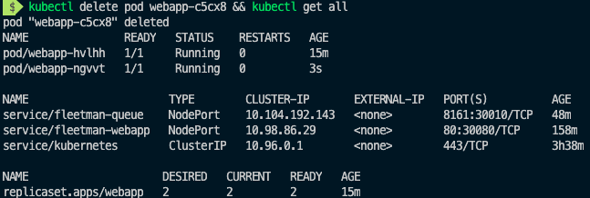

# Replica Sets

Adding the new configuration on the `pods.yml`, you can set to always have 2 or more pods running at any point in time.

Running the command on this directory:

```bash
kubectl apply -f .
```

and then

```bash
kubectl describe rs webapp
```
(rs stands for replica-set), then you will see a similar output



Running command `kubectl get all` will give you the pods currently running.

Do `kubeclt delete pod webapp<auto-generated-suffix>` and then immediately go again the `get all` command, you will see that it restarts another pod. Because we selected 2 pods, you can say that there would not be a downtime on the app as 1 was still running.

If you are quick enough, then you will see a status of `Terminating` and `Creating`.

But now we can see the new created pod:


