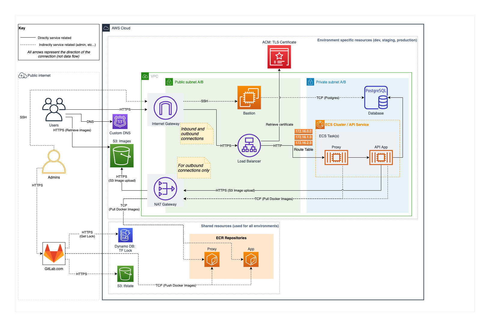

# Recipe App API DevOps

This project was originally hosted on my Gitlab account, and the CI/CD pipelines had been configured to work with gitlab instead of github actions. You can check the original project [here](https://gitlab.com/hgmeza/django-recipe-api-devops)

## Architecture



## Getting started

To start project, run:

```
docker-compose up
```

The API will then be available at http://127.0.0.1:8000
